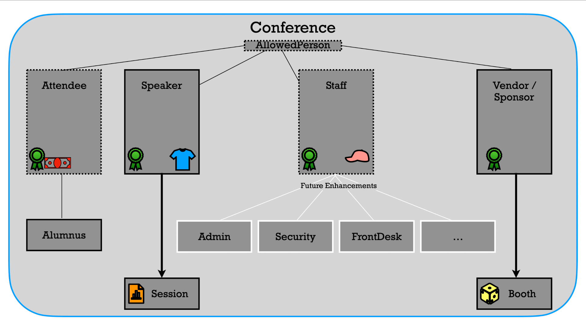

= Setting up the project

== Tooling used
* *JDK 1.8.0_391* (or later version of Java 8) installed on your computer
* *JDK 23* installed on your computer
* *Apache Maven 3.9.6* (or greater) installed on your computer
* *IntelliJ* or similar IDE for Java.
* A *toolchains.xml* file (similar to the one for MacOS in the root of this project)
** The toolchains point to JDK 8 and 23 used in the project.

== Initial setup
. Launch the project in the IDE (can be configured as a maven project, pointing to the root pom.xml, and the toolchains.xml for JDKs used)

=== Conference
ifdef::env-github[]
++++

  

++++
endif::[]

ifndef::env-github[]

endif::[]

=== Test Java 8 code:

. Verify that the module *java8* uses *JDK 8* (note, do not rely on source/target compatibility in the IDE force set the module to use JDK 8).
. Run the App.java under link:../../java8/src/main/java/conf/App.java[App.java]
. Verify output.

=== Test Java 23 code:

. Verify that the module *java23* uses *JDK 23* (experimental features should be allowed).
. Run the App.java under link:../../java23/src/main/java/conf/App.java[App.java]
. Verify output looks structurally similar to the one from java8.

=== Update the Java 8 module to use Java 23

. Find instances of FIXME in the java8 module link:../../java8/pom.xml[pom.xml]. Fix per advise.
. Ensure that the module java8 now uses Java 23 as its JDK.
. Follow the numbered FIXME instructions to learn great features added to Java from Java 8 until Java 23!
